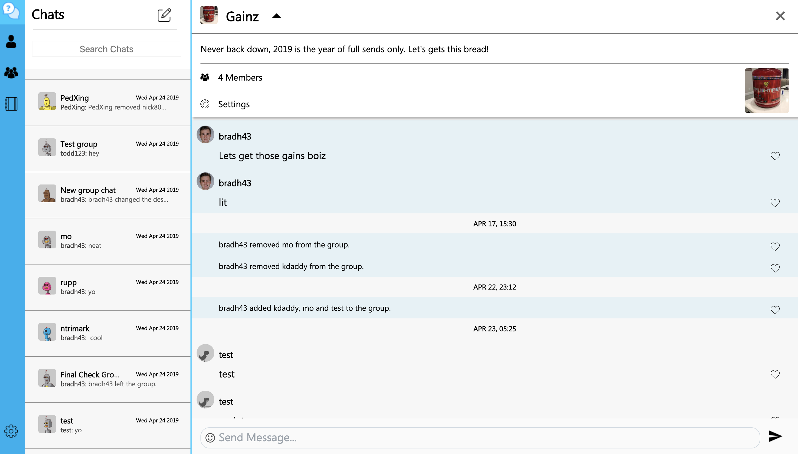
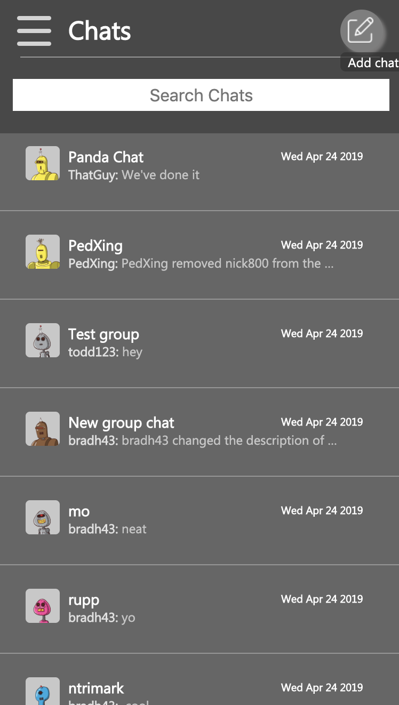

# Group Chat #

# Running the program #
Navigate to the groupchat folder and run npm install to download the node modules. Then run npm start or node app.js to run the program. You can also view the project here: http://ec2-18-219-118-115.us-east-2.compute.amazonaws.com:3456/

## Description: ##
This project is suppose to be my attempt at making a GroupMe clone using the node.js express backend. Users should be able to join groups and each group chat will store the messages in a database such as mongoDB. Users in the chat will be able send messages and be able  to like the messages and socket.io will be able to update the chat for other users. A user will be able to start a group and add users to it as well as kick or ban users if they are a owner or admin. This project has many features. The first is the ability to change profile picture and group chat picture, this uses multer to accomplish uploading the image to the server. Next added the ability to change the setting from light mode to dark mode. Also added the ability to choose between military and standard time. Next added unread notfication count next to each chat. In addition to this the chats are sorted by chat with the last recieved message and chats change order as messages are sent. Next have it so it is running on ec2 using pm2. Also added preview message to each chat in the list along with who sent the last message and the time it was sent. 

## Screen Shots
### Login Screen

    

 

### Home Screen

    

 

## Support for darkmode

    

 

### Adding a group member

    

 

### Mobile Friendly

    

 
